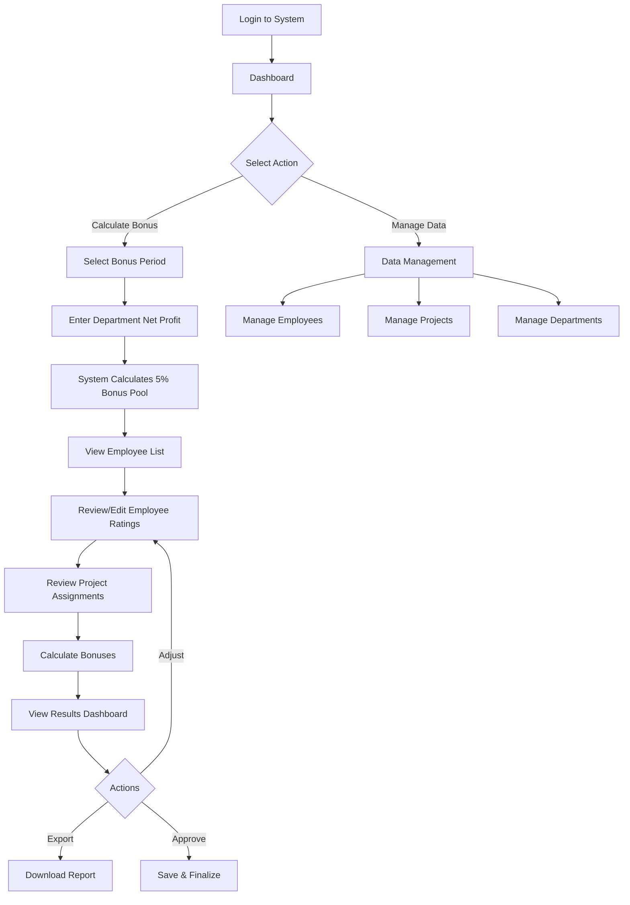
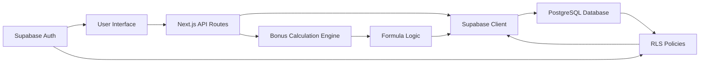
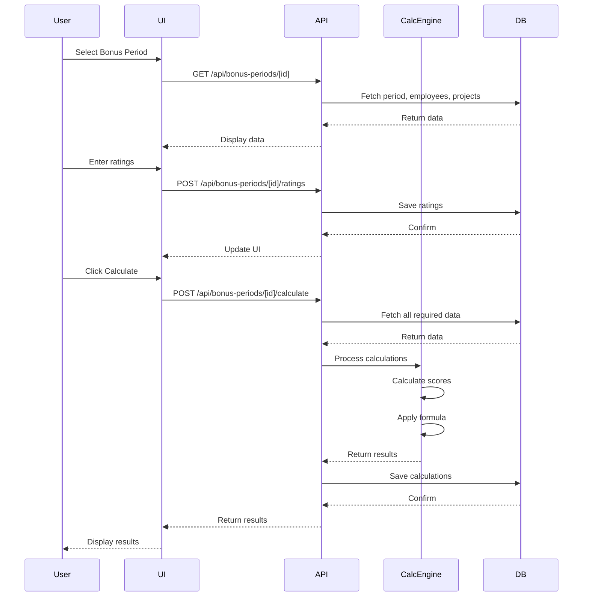

# Employee Bonus Calculation System - Design Document

## Executive Summary

This document outlines the design for a web-based employee bonus calculation system that distributes department bonuses based on employee contributions, project revenue participation, and salary considerations.

---

## 1. Bonus Calculation Formula

### Core Principle
The department bonus pool (5% of net profit) is distributed among employees using a weighted formula that considers:
- **40%** - Employee Contributions (Performance Rating)
- **40%** - Revenue Participation (Project Revenue Share)
- **20%** - Salary Adjustment (Inverse relationship for equity)

### Mathematical Model

#### Step 1: Calculate Individual Scores

For each employee `i`:

**A. Contribution Score (CS)**
```
CS_i = (Performance_Rating_i / Max_Rating) × 100
```
- Performance Rating: 1-10 scale (manager assigned)
- Max Rating: 10
- Result: 0-100 score

**B. Revenue Participation Score (RPS)**
```
Employee_Revenue_i = Σ(Project_Revenue_j / Number_of_Employees_on_Project_j)

RPS_i = (Employee_Revenue_i / Total_Department_Revenue) × 100
```
- Equal split: Each project's revenue divided by number of employees
- Normalized against total department revenue
- Result: 0-100+ score (can exceed 100 if employee contributes to high-revenue projects)

**C. Salary Adjustment Score (SAS)**
```
SAS_i = (1 - (Employee_Salary_i / Max_Department_Salary)) × 100
```
- Inverse relationship: Lower salary = higher score
- Normalized against highest salary in department
- Result: 0-100 score (lowest paid gets 100, highest paid gets 0)

#### Step 2: Calculate Weighted Score

```
Weighted_Score_i = (CS_i × 0.40) + (RPS_i × 0.40) + (SAS_i × 0.20)
```

#### Step 3: Calculate Bonus Share

```
Total_Weighted_Score = Σ(Weighted_Score_i) for all employees

Bonus_Share_i = Weighted_Score_i / Total_Weighted_Score

Employee_Bonus_i = Bonus_Share_i × Department_Bonus_Pool
```

### Example Calculation

**Given:**
- Department Bonus Pool: $50,000
- Total Department Revenue: $1,000,000

**Employee A:**
- Performance Rating: 8/10
- Projects: Project X ($300k, 3 employees), Project Y ($200k, 2 employees)
- Salary: $60,000
- Max Department Salary: $100,000

**Calculations:**
1. CS_A = (8/10) × 100 = 80
2. Employee_Revenue_A = ($300k/3) + ($200k/2) = $100k + $100k = $200k
   RPS_A = ($200k / $1,000k) × 100 = 20
3. SAS_A = (1 - ($60k/$100k)) × 100 = 40

Weighted_Score_A = (80 × 0.40) + (20 × 0.40) + (40 × 0.20) = 32 + 8 + 8 = 48

If Total_Weighted_Score for all employees = 300:
- Bonus_Share_A = 48/300 = 16%
- Employee_Bonus_A = 0.16 × $50,000 = $8,000

---

## 2. User Journey

### Primary User Flow



### Detailed User Journeys

#### Journey 1: Calculate Department Bonuses (Primary Flow)

1. **Login & Navigation**
   - User logs in with credentials
   - Lands on dashboard showing recent bonus calculations

2. **Initiate Bonus Calculation**
   - Click "Calculate New Bonus"
   - Select department from dropdown
   - Select bonus period (Q1 2024, Q2 2024, etc.)

3. **Enter Financial Data**
   - Input department net profit for the period
   - System automatically calculates 5% bonus pool
   - Display: "Bonus Pool: $50,000"

4. **Review Employee Data**
   - View table of all department employees
   - Columns: Name, Salary, Current Projects, Last Rating
   - Filter/search capabilities

5. **Assign Performance Ratings**
   - For each employee, enter performance rating (1-10)
   - Optional: Add notes/justification
   - Visual indicator: Color-coded ratings (red=1-3, yellow=4-7, green=8-10)

6. **Review Project Assignments**
   - View project list with revenues
   - See which employees are assigned to each project
   - Add/remove employee-project associations if needed

7. **Calculate & Preview**
   - Click "Calculate Bonuses"
   - System processes formula
   - Display results table with breakdown:
     - Employee Name
     - Contribution Score
     - Revenue Score
     - Salary Adjustment Score
     - Weighted Score
     - Bonus Amount
     - Percentage of Pool

8. **Review & Adjust**
   - Review calculations
   - Option to adjust ratings and recalculate
   - View detailed breakdown for any employee

9. **Finalize & Export**
   - Approve calculations
   - Export to PDF/Excel
   - Save to database
   - Send notifications (optional)

#### Journey 2: Manage Employee Data

1. Navigate to "Employees" section
2. View all employees with filters (department, status)
3. Add new employee (name, email, salary, department, hire date)
4. Edit existing employee details
5. Deactivate/archive employees who left

#### Journey 3: Manage Projects

1. Navigate to "Projects" section
2. View all projects with revenue data
3. Add new project (name, revenue, department, status)
4. Assign employees to projects
5. Update project revenue as needed
6. Close/archive completed projects

#### Journey 4: View Historical Data

1. Navigate to "Bonus History"
2. Filter by department, period, employee
3. View past bonus calculations
4. Compare periods
5. Export historical reports

---

## 3. Database Schema (Supabase)

### Tables

#### `departments`
```sql
CREATE TABLE departments (
  id UUID PRIMARY KEY DEFAULT uuid_generate_v4(),
  name VARCHAR(255) NOT NULL,
  description TEXT,
  created_at TIMESTAMP DEFAULT NOW(),
  updated_at TIMESTAMP DEFAULT NOW()
);
```

#### `employees`
```sql
CREATE TABLE employees (
  id UUID PRIMARY KEY DEFAULT uuid_generate_v4(),
  department_id UUID REFERENCES departments(id),
  first_name VARCHAR(100) NOT NULL,
  last_name VARCHAR(100) NOT NULL,
  email VARCHAR(255) UNIQUE NOT NULL,
  salary DECIMAL(12, 2) NOT NULL,
  hire_date DATE,
  status VARCHAR(20) DEFAULT 'active', -- active, inactive, archived
  created_at TIMESTAMP DEFAULT NOW(),
  updated_at TIMESTAMP DEFAULT NOW()
);
```

#### `projects`
```sql
CREATE TABLE projects (
  id UUID PRIMARY KEY DEFAULT uuid_generate_v4(),
  department_id UUID REFERENCES departments(id),
  name VARCHAR(255) NOT NULL,
  description TEXT,
  revenue DECIMAL(12, 2) NOT NULL DEFAULT 0,
  status VARCHAR(20) DEFAULT 'active', -- active, completed, archived
  start_date DATE,
  end_date DATE,
  created_at TIMESTAMP DEFAULT NOW(),
  updated_at TIMESTAMP DEFAULT NOW()
);
```

#### `employee_projects`
```sql
CREATE TABLE employee_projects (
  id UUID PRIMARY KEY DEFAULT uuid_generate_v4(),
  employee_id UUID REFERENCES employees(id) ON DELETE CASCADE,
  project_id UUID REFERENCES projects(id) ON DELETE CASCADE,
  assigned_at TIMESTAMP DEFAULT NOW(),
  UNIQUE(employee_id, project_id)
);
```

#### `bonus_periods`
```sql
CREATE TABLE bonus_periods (
  id UUID PRIMARY KEY DEFAULT uuid_generate_v4(),
  department_id UUID REFERENCES departments(id),
  name VARCHAR(100) NOT NULL, -- e.g., "Q1 2024"
  start_date DATE NOT NULL,
  end_date DATE NOT NULL,
  net_profit DECIMAL(12, 2) NOT NULL,
  bonus_pool DECIMAL(12, 2) GENERATED ALWAYS AS (net_profit * 0.05) STORED,
  status VARCHAR(20) DEFAULT 'draft', -- draft, calculated, finalized
  created_at TIMESTAMP DEFAULT NOW(),
  updated_at TIMESTAMP DEFAULT NOW(),
  finalized_at TIMESTAMP,
  finalized_by UUID REFERENCES auth.users(id)
);
```

#### `employee_ratings`
```sql
CREATE TABLE employee_ratings (
  id UUID PRIMARY KEY DEFAULT uuid_generate_v4(),
  bonus_period_id UUID REFERENCES bonus_periods(id) ON DELETE CASCADE,
  employee_id UUID REFERENCES employees(id) ON DELETE CASCADE,
  performance_rating INTEGER CHECK (performance_rating >= 1 AND performance_rating <= 10),
  notes TEXT,
  rated_by UUID REFERENCES auth.users(id),
  created_at TIMESTAMP DEFAULT NOW(),
  updated_at TIMESTAMP DEFAULT NOW(),
  UNIQUE(bonus_period_id, employee_id)
);
```

#### `bonus_calculations`
```sql
CREATE TABLE bonus_calculations (
  id UUID PRIMARY KEY DEFAULT uuid_generate_v4(),
  bonus_period_id UUID REFERENCES bonus_periods(id) ON DELETE CASCADE,
  employee_id UUID REFERENCES employees(id) ON DELETE CASCADE,
  contribution_score DECIMAL(5, 2),
  revenue_score DECIMAL(5, 2),
  salary_adjustment_score DECIMAL(5, 2),
  weighted_score DECIMAL(5, 2),
  bonus_amount DECIMAL(12, 2),
  bonus_percentage DECIMAL(5, 2),
  calculation_details JSONB, -- Store detailed breakdown
  created_at TIMESTAMP DEFAULT NOW(),
  UNIQUE(bonus_period_id, employee_id)
);
```

### Indexes

```sql
CREATE INDEX idx_employees_department ON employees(department_id);
CREATE INDEX idx_employees_status ON employees(status);
CREATE INDEX idx_projects_department ON projects(department_id);
CREATE INDEX idx_employee_projects_employee ON employee_projects(employee_id);
CREATE INDEX idx_employee_projects_project ON employee_projects(project_id);
CREATE INDEX idx_bonus_periods_department ON bonus_periods(department_id);
CREATE INDEX idx_bonus_periods_status ON bonus_periods(status);
CREATE INDEX idx_employee_ratings_period ON employee_ratings(bonus_period_id);
CREATE INDEX idx_bonus_calculations_period ON bonus_calculations(bonus_period_id);
```

### Row Level Security (RLS) Policies

```sql
-- Enable RLS
ALTER TABLE departments ENABLE ROW LEVEL SECURITY;
ALTER TABLE employees ENABLE ROW LEVEL SECURITY;
ALTER TABLE projects ENABLE ROW LEVEL SECURITY;
ALTER TABLE employee_projects ENABLE ROW LEVEL SECURITY;
ALTER TABLE bonus_periods ENABLE ROW LEVEL SECURITY;
ALTER TABLE employee_ratings ENABLE ROW LEVEL SECURITY;
ALTER TABLE bonus_calculations ENABLE ROW LEVEL SECURITY;

-- Example policy: Users can only see data from their department
CREATE POLICY "Users can view their department data"
  ON employees FOR SELECT
  USING (
    department_id IN (
      SELECT department_id FROM employees 
      WHERE email = auth.jwt() ->> 'email'
    )
  );
```

---

## 4. Technical Architecture

### Technology Stack Recommendations

**Frontend:**
- **Framework**: Next.js 14+ (App Router)
- **UI Library**: shadcn/ui + Tailwind CSS
- **State Management**: Zustand or React Context
- **Forms**: React Hook Form + Zod validation
- **Charts**: Recharts or Chart.js
- **Tables**: TanStack Table (React Table v8)

**Backend:**
- **Database**: Supabase (PostgreSQL)
- **Authentication**: Supabase Auth
- **API**: Supabase Client + Next.js API Routes
- **Real-time**: Supabase Realtime (optional)

**DevOps:**
- **Hosting**: Vercel
- **Version Control**: Git/GitHub
- **CI/CD**: Vercel automatic deployments

### Application Structure

```
bonus-calculator/
├── app/
│   ├── (auth)/
│   │   ├── login/
│   │   └── register/
│   ├── (dashboard)/
│   │   ├── layout.tsx
│   │   ├── page.tsx                 # Dashboard home
│   │   ├── employees/
│   │   │   ├── page.tsx             # Employee list
│   │   │   ├── [id]/
│   │   │   └── new/
│   │   ├── projects/
│   │   │   ├── page.tsx             # Project list
│   │   │   ├── [id]/
│   │   │   └── new/
│   │   ├── bonus-calculation/
│   │   │   ├── page.tsx             # Bonus period list
│   │   │   ├── new/
│   │   │   └── [id]/
│   │   │       ├── page.tsx         # Calculation interface
│   │   │       ├── ratings/
│   │   │       ├── projects/
│   │   │       └── results/
│   │   └── history/
│   ├── api/
│   │   ├── calculate-bonus/
│   │   ├── employees/
│   │   └── projects/
│   └── layout.tsx
├── components/
│   ├── ui/                          # shadcn components
│   ├── employees/
│   │   ├── EmployeeTable.tsx
│   │   ├── EmployeeForm.tsx
│   │   └── EmployeeCard.tsx
│   ├── projects/
│   │   ├── ProjectTable.tsx
│   │   ├── ProjectForm.tsx
│   │   └── ProjectAssignment.tsx
│   ├── bonus/
│   │   ├── BonusCalculator.tsx
│   │   ├── RatingInput.tsx
│   │   ├── ResultsTable.tsx
│   │   ├── ResultsChart.tsx
│   │   └── BonusBreakdown.tsx
│   └── layout/
│       ├── Navbar.tsx
│       ├── Sidebar.tsx
│       └── Footer.tsx
├── lib/
│   ├── supabase/
│   │   ├── client.ts
│   │   ├── server.ts
│   │   └── types.ts
│   ├── calculations/
│   │   └── bonus-formula.ts
│   ├── utils/
│   │   ├── formatting.ts
│   │   └── validation.ts
│   └── hooks/
│       ├── useEmployees.ts
│       ├── useProjects.ts
│       └── useBonusCalculation.ts
├── types/
│   └── index.ts
└── public/
```

---

## 5. API Endpoints & Data Flow

### Core API Routes

#### 1. Employee Management
```typescript
GET    /api/employees              // List all employees
GET    /api/employees/[id]         // Get employee details
POST   /api/employees              // Create employee
PUT    /api/employees/[id]         // Update employee
DELETE /api/employees/[id]         // Delete employee
```

#### 2. Project Management
```typescript
GET    /api/projects               // List all projects
GET    /api/projects/[id]          // Get project details
POST   /api/projects               // Create project
PUT    /api/projects/[id]          // Update project
DELETE /api/projects/[id]          // Delete project
POST   /api/projects/[id]/assign   // Assign employees to project
```

#### 3. Bonus Calculation
```typescript
GET    /api/bonus-periods                    // List bonus periods
POST   /api/bonus-periods                    // Create bonus period
GET    /api/bonus-periods/[id]               // Get period details
PUT    /api/bonus-periods/[id]               // Update period
POST   /api/bonus-periods/[id]/ratings       // Submit ratings
POST   /api/bonus-periods/[id]/calculate     // Calculate bonuses
GET    /api/bonus-periods/[id]/results       // Get calculation results
POST   /api/bonus-periods/[id]/finalize      // Finalize calculations
GET    /api/bonus-periods/[id]/export        // Export results
```

### Data Flow Diagram



### Bonus Calculation Flow



---

## 6. Key Features & Components

### Dashboard Features

1. **Overview Cards**
   - Total employees in department
   - Active projects count
   - Current bonus pool amount
   - Last calculation date

2. **Quick Actions**
   - Start new bonus calculation
   - View recent calculations
   - Manage employees
   - Manage projects

3. **Recent Activity**
   - Timeline of recent actions
   - Pending calculations
   - Upcoming bonus periods

### Bonus Calculation Interface

1. **Step-by-Step Wizard**
   - Step 1: Select period & enter net profit
   - Step 2: Review/edit employee ratings
   - Step 3: Review project assignments
   - Step 4: Calculate & preview results
   - Step 5: Finalize & export

2. **Rating Interface**
   - Slider or number input (1-10)
   - Visual feedback (color coding)
   - Notes field for justification
   - Bulk actions (apply rating to multiple)

3. **Results Dashboard**
   - Sortable/filterable table
   - Visual breakdown charts
   - Individual employee detail view
   - Export options (PDF, Excel, CSV)

4. **Breakdown View**
   - Pie chart: Score distribution
   - Bar chart: Bonus amounts comparison
   - Detailed calculation steps for each employee
   - Formula explanation

### Employee Management

1. **Employee List**
   - Searchable/filterable table
   - Sort by name, salary, department
   - Quick edit inline
   - Bulk actions

2. **Employee Detail**
   - Personal information
   - Salary history
   - Project assignments
   - Bonus history
   - Performance ratings over time

### Project Management

1. **Project List**
   - Active/completed filter
   - Revenue tracking
   - Employee count per project
   - Status indicators

2. **Project Detail**
   - Project information
   - Revenue breakdown
   - Assigned employees
   - Timeline
   - Add/remove employees

---

## 7. Implementation Phases

### Phase 1: Foundation (Week 1-2)
- [ ] Set up Next.js project with TypeScript
- [ ] Configure Supabase project
- [ ] Create database schema and tables
- [ ] Set up authentication
- [ ] Create basic layout and navigation
- [ ] Implement RLS policies

### Phase 2: Core Data Management (Week 3-4)
- [ ] Build employee CRUD operations
- [ ] Build project CRUD operations
- [ ] Implement employee-project assignment
- [ ] Create department management
- [ ] Build data validation

### Phase 3: Bonus Calculation Engine (Week 5-6)
- [ ] Implement bonus formula logic
- [ ] Create bonus period management
- [ ] Build rating input interface
- [ ] Develop calculation API endpoint
- [ ] Create results storage

### Phase 4: User Interface (Week 7-8)
- [ ] Design and build dashboard
- [ ] Create bonus calculation wizard
- [ ] Build results visualization
- [ ] Implement export functionality
- [ ] Add historical data views

### Phase 5: Polish & Testing (Week 9-10)
- [ ] Comprehensive testing
- [ ] Performance optimization
- [ ] Error handling improvements
- [ ] User feedback implementation
- [ ] Documentation

### Phase 6: Deployment (Week 11)
- [ ] Production deployment
- [ ] User training
- [ ] Monitoring setup
- [ ] Backup procedures

---

## 8. Security Considerations

1. **Authentication & Authorization**
   - Role-based access control (Admin, Manager, Viewer)
   - Department-level data isolation
   - Secure session management

2. **Data Protection**
   - Salary information encryption
   - Audit logs for all calculations
   - Secure API endpoints
   - Input validation and sanitization

3. **RLS Policies**
   - Users can only access their department data
   - Managers can edit ratings
   - Admins have full access
   - Read-only access for viewers

---

## 9. Future Enhancements

1. **Advanced Features**
   - Multi-department comparisons
   - Predictive bonus modeling
   - Integration with HR systems
   - Automated email notifications
   - Mobile app

2. **Analytics**
   - Trend analysis over time
   - Performance correlation insights
   - Budget forecasting
   - Custom reporting

3. **Collaboration**
   - Comments on calculations
   - Approval workflows
   - Version history
   - Change tracking

---

## 10. Success Metrics

1. **Calculation Accuracy**: 100% formula correctness
2. **User Adoption**: 90%+ of managers using the system
3. **Time Savings**: 75% reduction in manual calculation time
4. **User Satisfaction**: 4.5+ rating out of 5
5. **System Performance**: < 2 second page load times

---

## Conclusion

This design provides a comprehensive foundation for building an employee bonus calculation system. The weighted formula ensures fair distribution based on multiple factors, while the user-friendly interface makes the process efficient and transparent.

The system is designed to be scalable, secure, and maintainable, with clear separation of concerns and modern best practices.